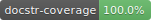

[](https://www.paypal.com/cgi-bin/webscr?cmd=_donations&business=C8FBBG2RZ5WYS&currency_code=EUR&source=url)
[](https://travis-ci.com/stefanthaler/tinydb-encrypted-jsonstorage)
[](https://coveralls.io/github/stefanthaler/tinydb-encrypted-jsonstorage?branch=master)
[](https://pypi.org/project/docstr-coverage/)

[](https://opensource.org/licenses/MIT)

# tinydb-encrypted-jsonstorage
A TinyDB storage implementation that stores values as encrypted json.

# Requirements
## Python
* [TinyDB](https://tinydb.readthedocs.io/en/latest/getting-started.html)
* [pycryptodome](https://pycryptodome.readthedocs.io/en/latest/)

## OS Dependencies:
* python3, python3-venv, python3-pip

# Get Sources
* git clone git@github.com:stefanthaler/tinydb-encrypted-jsonstorage.git
* cd tinydb-encrypted-jsonstorage
* python3 -m venv .env
* . .env/bin/activate.fish  
* pip install -r requirements.txt

# Build
* follow steps in "Get Sources"
* pip3 install -r requirements-building.txt
* python setup.py bdist_wheel

# Test
* follow steps in "Get Sources"
* pip3 install -r requirements-building.txt
* python setup.py test

# Install

## Pip
* pip install tinydb-encrypted-jsonstorage

## Pip + Git
* pip install git+git://github.com/stefanthaler/tinydb-encrypted-jsonstorag.git#egg=tinydb-encrypted-jsonstorage

## Git + Local Pip
* Follow steps in "Build"
* pip install ./

# Use

## Create database
You can use the encrypted storage by adding setting storage parameter of the TinyDB initializer to the EncryptedJSONStorage class.

``` python
from tinydb import TinyDB
import tinydb_encrypted_jsonstorage as tae
KEY = "hello"
PATH = ".encrypted_db"
db = TinyDB(encryption_key=KEY, path=PATH, storage=tae.EncryptedJSONStorage)
```

## Change encryption key
You can change the encryption key of the storage by accessing the storage property of your [TinyDB](https://tinydb.readthedocs.io/en/latest/index.html) database.

``` python
db = ...
db.storage.change_encryption_key("NEW_KEY"))
```

## Other operations

For all the other operations, check the [TinyDB manual](https://tinydb.readthedocs.io/en/latest/index.html).

## TODO
* documentation coverage + badge https://github.com/google/pybadges

# Thanks  
* Shields.io, for providing the github paypal and the MIT license button: https://shields.io/
* [travis-ci.org](https://travis-ci.org) for providing free continuous integration for open source projects.
* [coveralls.io](https://coveralls.io) for providing free continuous code coverage reporting for open source projects.
